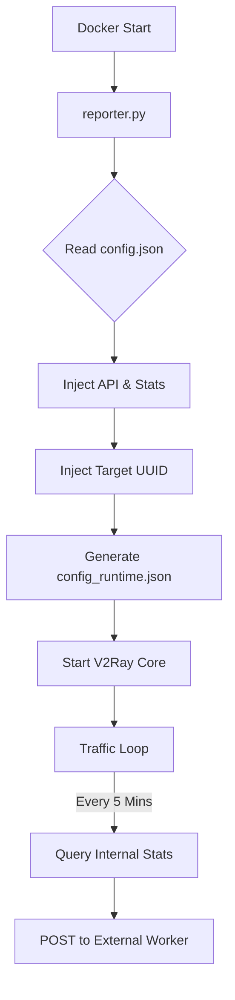

# How This Project Works

This project is a specialized **VLESS Proxy** deployment designed for **Google Cloud Run**. Unlike standard static V2Ray deployments, this project uses a dynamic runtime wrapper to manage configuration, enforce user identity, and report traffic usage to an external API.

## 🚀 Architecture Overview

The system consists of three main components running inside a Docker container:

1.  **V2Ray/Xray Core**: The underlying proxy engine handling network traffic.
2.  **Reporter Script (`reporter.py`)**: A Python-based controller that manages the V2Ray process and handles logic.
3.  **Base Config (`config.json`)**: A template configuration file that is modified at runtime.

### System Flow



---

## 🛠 Core Components

### 1. The Controller (`reporter.py`)
This script is the container's entrypoint. It performs two critical functions:

#### **Phase 1: Runtime Configuration Injection**
Before starting V2Ray, the script reads the static `config.json` and dynamically injects the following:
*   **Local API**: Opens port `10085` (dokodemo-door) to allow the script to query V2Ray.
*   **Statistics & Policy**: Enables traffic counting (uplink/downlink) for the user level.
*   **User Identity**: Replaces the placeholder UUID in the VLESS inbound with the target UUID (`779548c3...`).

This ensures that the `config.json` in the repository remains clean and generic, while the running instance is fully instrumented.

#### **Phase 2: Monitoring Loop**
Once V2Ray is running, the script enters an infinite loop:
1.  **Sleeps** for 5 minutes.
2.  **Queries** the V2Ray API (`StatsService.QueryStats`) via gRPC/CLI.
3.  **Parses** the traffic data for the specific user email (`user@v2ray`).
4.  **Reports** the data via an HTTP POST request to the external Cloudflare Worker:
    *   `https://hydroponic-worker.aung-245.workers.dev/?uuid=...`

### 2. The Container (`Dockerfile`)
The Dockerfile is built on top of `teddysun/v2ray`, adding:
*   **Python 3**: Required to run the reporter script.
*   **Entrypoint Override**: Instead of running `v2ray` directly, it runs `python3 /reporter.py`.

---

## 📊 Data Reporting Format

The reporter sends a simple JSON payload to the worker endpoint:

```json
{
  "uplink": 12345678,    // Bytes sent
  "downlink": 87654321   // Bytes received
}
```

## 📝 Configuration Files

*   **`config.json`**: The source of truth for the proxy settings (ports, transport protocols, stream settings).
*   **`config_runtime.json`**: The actual file generated and used by V2Ray inside the container. It contains the injected API and UUID settings.

## ⚠️ Important Notes

*   **Runtime vs Static**: You do not need to edit `config.json` to change the UUID or enable stats. The `reporter.py` script handles this automatically.
*   **Fail-Safe**: If the V2Ray process crashes, the reporter script detects it and exits, causing the container to restart (if configured with a restart policy).
